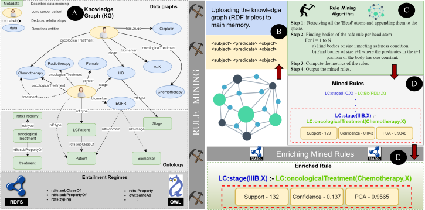

# Semantic-and-Efficient-Symbolic-Learning-over-Knowledge-Graphs

Semantic Symbolic learning over Knowledge Graphs (KGs) demonstrates a rule mining system to mine horn clauses.
The goal of rule mining is to identify new rules that entail a high ratio of positive edges from other positive edges, but a low ratio of negative edges from positive edges. 
The Federation of KGs cannot be used in the mining process in traditional approaches as they require the KGs to be uploaded in the main memory in order to execute the mining algorithm.
Traditional rule mining approaches fail to consider the ontology and in turn metadata encoded in a KG’s ontology. 
Ontology represents the backbone of the knowledge graphs that contains the formal semantics of the whole knowledge graph. 
Semantics allows people and computers to process the information that a knowledge graph contains efficiently and unambiguously. 
Further, the state-of-the-art methods also ignore the entailment regimes that specify an entailment relation between the graph nodes. 
Therefore, in our approach, we are enriching the rules that are mined incorporating the entailment regimes on top of the knowledge graph. The enriched rules after 
applying the RDFS and OWL entailment regimes are more efficient and can be counted as true predictions or missing relationships in the knowledge graphs which can be used to complete the knowledge graph.

# Examples of Horn rules

The rules are explained below:

1. The rule states that if a Lung cancer patient is in stage IIIA it is more likely that the patients recieve the oncological treatment Surgery . $stage(IIIA, x) \Rightarrow oncologicalTreatment(Surgery, x)$ 
2. If a Lung cancer patient was a former smoker and is in stage IV then he/she is more likely to receive oncological treatment Immunotherapy. $smokingHabit(FormerSmoker, x)\ \land\ stage(IV, x) \Rightarrow oncologicalTreatment(Immunotherapy, x)$

